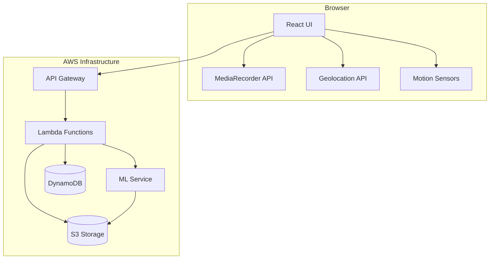
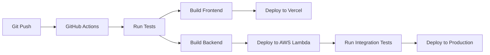

# Design Document

## Overview

The Lung Health Activity Monitoring System is a web-based application that combines voice biomarker analysis, physical activity monitoring, and machine learning to provide preventive lung health assessments. The system uses a serverless architecture deployed on AWS, with a React frontend and Python-based ML inference service.

### Key Design Principles

1. **Privacy-First**: No PHI storage, temporary session data only, encryption at rest and in transit
2. **Serverless Architecture**: Cost-effective, auto-scaling infrastructure using AWS Lambda
3. **Progressive Enhancement**: Graceful degradation when browser APIs are unavailable
4. **Multimodal Analysis**: Combines voice, activity, demographic, and environmental data
5. **Advisory Only**: Predictions are informational, not diagnostic

### System Architecture

The system follows a three-tier architecture:

1. **Frontend Tier**: React.js SPA with browser APIs for voice and location
2. **Backend Tier**: Node.js/Express serverless functions on AWS Lambda
3. **ML Tier**: Python inference service with XGBoost model



## Architecture

### Frontend Architecture

**Technology Stack**:
- React 18+ with functional components and hooks
- Vite for build tooling and development server
- TailwindCSS for styling
- React Router for navigation
- Axios for HTTP requests

**Key Components**:

1. **ProfileSetup**: User demographic data collection
2. **LocationPermission**: Geolocation permission management
3. **RegionalStats**: Display of regional health statistics
4. **SurveyFlow**: Optional health survey
5. **VoiceRecorder**: Pre/post activity voice recording
6. **ActivityMonitor**: Activity session tracking
7. **ResultsDisplay**: Prediction results and recommendations

**State Management**:
- React Context API for global state (user profile, session data)
- Local component state for UI interactions
- Browser localStorage for session persistence

### Backend Architecture

**API Gateway Configuration**:
- RESTful API endpoints
- CORS enabled for frontend domain
- Request validation and rate limiting
- API key authentication for ML service

**Lambda Functions**:

1. **ProfileHandler**: CRUD operations for user profiles
2. **SessionHandler**: Activity session management
3. **VoiceUploadHandler**: Voice sample upload to S3
4. **PredictionHandler**: Orchestrates ML prediction workflow
5. **RecommendationHandler**: Generates health recommendations
6. **StatsHandler**: Retrieves regional statistics

**Data Flow**:
```
Client Request → API Gateway → Lambda Function → DynamoDB/S3 → Response
                                      ↓
                                 ML Service (for predictions)
```

### ML Service Architecture

**Model**: XGBoost Classifier
- Binary or multi-class classification (Severe, Average, Good)
- Trained on synthetic/public respiratory health datasets
- Feature extraction from voice samples and activity metrics

**Feature Engineering**:

Voice Features:
- Mel-frequency cepstral coefficients (MFCCs)
- Pitch variation
- Speech rate
- Pause patterns
- Voice intensity

Activity Features:
- Total activity duration
- Number of breaks
- Average break duration
- Activity intensity (if motion sensors available)

Demographic Features:
- Age group
- Location-based environmental factors

**Inference Pipeline**:
```
Voice Samples → Feature Extraction → Feature Vector → XGBoost Model → Health Category
Activity Data ↗                                                              ↓
Demographics ↗                                                         Confidence Score
```

### Data Storage Architecture

**S3 Buckets**:
- `voice-samples-bucket`: Encrypted voice recordings (temporary, 30-day retention)
- `ml-models-bucket`: XGBoost model artifacts
- `datasets-bucket`: Training/validation datasets

**DynamoDB Tables**:

1. **Users Table**:
   - Partition Key: userId (UUID)
   - Attributes: name, age, phone, insuranceProvider, location, createdAt

2. **Sessions Table**:
   - Partition Key: sessionId (UUID)
   - Sort Key: timestamp
   - Attributes: userId, preVoiceUrl, postVoiceUrl, activityData, surveyResponses, status

3. **Predictions Table**:
   - Partition Key: sessionId
   - Attributes: healthCategory, confidenceScore, timestamp, recommendations

4. **RegionalStats Table**:
   - Partition Key: region (geohash)
   - Sort Key: ageGroup
   - Attributes: avgHealthScore, sampleSize, lastUpdated

## Components and Interfaces

### Frontend Components

#### VoiceRecorder Component

**Purpose**: Capture voice samples using MediaRecorder API

**Interface**:
```typescript
interface VoiceRecorderProps {
  onRecordingComplete: (audioBlob: Blob) => void;
  minDuration: number; // seconds
  onError: (error: Error) => void;
}

interface AudioQualityMetrics {
  volume: number;
  clarity: number;
  duration: number;
  isValid: boolean;
}
```

**Behavior**:
- Requests microphone permission
- Records audio in WebM or MP4 format (browser-dependent)
- Validates audio quality (volume, duration)
- Provides visual feedback during recording
- Handles errors gracefully

#### ActivityMonitor Component

**Purpose**: Track physical activity using motion sensors or timer

**Interface**:
```typescript
interface ActivityMonitorProps {
  onActivityStart: () => void;
  onActivityEnd: (metrics: ActivityMetrics) => void;
  onBreakDetected: (breakDuration: number) => void;
}

interface ActivityMetrics {
  totalDuration: number; // seconds
  activeTime: number; // seconds excluding breaks
  breaks: BreakRecord[];
  motionData?: MotionData[]; // if sensors available
}

interface BreakRecord {
  startTime: number;
  duration: number;
}
```

**Behavior**:
- Attempts to use DeviceMotion API if available
- Falls back to timer-based tracking if sensors unavailable
- Detects breaks (>30 seconds of inactivity)
- Provides real-time activity feedback

#### LocationPermission Component

**Purpose**: Manage geolocation permissions and location tracking

**Interface**:
```typescript
interface LocationPermissionProps {
  onPermissionGranted: (location: Coordinates) => void;
  onPermissionDenied: () => void;
}

interface Coordinates {
  latitude: number;
  longitude: number;
  accuracy: number;
  timestamp: number;
}
```

**Behavior**:
- Requests geolocation permission with explanation
- Handles permission states (granted, denied, prompt)
- Monitors significant location changes
- Provides fallback UI when permission denied

### Backend API Endpoints

#### POST /api/profile

**Purpose**: Create or update user profile

**Request**:
```json
{
  "name": "string",
  "age": number,
  "phone": "string",
  "insuranceProvider": "string?" // optional
}
```

**Response**:
```json
{
  "userId": "uuid",
  "profile": { /* user data */ },
  "createdAt": "timestamp"
}
```

**Validation**:
- Name: non-empty string
- Age: 1-120
- Phone: valid format (E.164)

#### POST /api/session/start

**Purpose**: Initialize activity session

**Request**:
```json
{
  "userId": "uuid",
  "location": {
    "latitude": number,
    "longitude": number
  },
  "surveyResponses": object? // optional
}
```

**Response**:
```json
{
  "sessionId": "uuid",
  "status": "initialized",
  "timestamp": "timestamp"
}
```

#### POST /api/voice/upload

**Purpose**: Upload voice sample to S3

**Request**:
- Multipart form data with audio file
- Headers: sessionId, recordingType (pre|post)

**Response**:
```json
{
  "voiceUrl": "s3://bucket/key",
  "uploadedAt": "timestamp"
}
```

**Processing**:
- Validates audio format and size
- Generates unique S3 key
- Uploads with server-side encryption
- Updates session record

#### POST /api/session/complete

**Purpose**: Finalize session and trigger prediction

**Request**:
```json
{
  "sessionId": "uuid",
  "activityMetrics": {
    "totalDuration": number,
    "activeTime": number,
    "breaks": array
  }
}
```

**Response**:
```json
{
  "sessionId": "uuid",
  "status": "processing",
  "estimatedTime": number // seconds
}
```

**Processing**:
- Validates session has both voice samples
- Invokes ML service asynchronously
- Returns immediately with processing status

#### GET /api/prediction/:sessionId

**Purpose**: Retrieve prediction results

**Response**:
```json
{
  "sessionId": "uuid",
  "healthCategory": "Severe" | "Average" | "Good",
  "confidenceScore": number,
  "recommendations": array,
  "timestamp": "timestamp"
}
```

#### GET /api/stats/regional

**Purpose**: Get regional health statistics

**Query Parameters**:
- latitude: number
- longitude: number
- ageGroup: string (e.g., "20-29")

**Response**:
```json
{
  "region": "string",
  "ageGroup": "string",
  "avgHealthScore": number,
  "sampleSize": number,
  "lastUpdated": "timestamp"
}
```

### ML Service Interface

#### POST /ml/predict

**Purpose**: Generate lung health prediction

**Request**:
```json
{
  "sessionId": "uuid",
  "preVoiceUrl": "s3://...",
  "postVoiceUrl": "s3://...",
  "activityMetrics": object,
  "demographics": {
    "age": number,
    "location": object
  },
  "surveyResponses": object?
}
```

**Response**:
```json
{
  "healthCategory": "Severe" | "Average" | "Good",
  "confidenceScore": number,
  "featureImportance": object,
  "processingTime": number
}
```

**Processing Steps**:
1. Download voice samples from S3
2. Extract audio features using librosa
3. Combine with activity and demographic features
4. Normalize feature vector
5. Run XGBoost inference
6. Return prediction with confidence

## Data Models

### User Profile

```typescript
interface UserProfile {
  userId: string; // UUID
  name: string;
  age: number; // 1-120
  phone: string; // E.164 format
  insuranceProvider?: string;
  location: {
    latitude: number;
    longitude: number;
    region: string; // geohash
  };
  createdAt: number; // Unix timestamp
  updatedAt: number;
}
```

**Validation Rules**:
- userId: Valid UUID v4
- name: 1-100 characters, non-empty
- age: Integer between 1 and 120
- phone: Valid E.164 format
- location: Valid coordinates (-90 to 90 lat, -180 to 180 lon)

### Activity Session

```typescript
interface ActivitySession {
  sessionId: string; // UUID
  userId: string; // Foreign key to User
  status: SessionStatus;
  preVoiceUrl?: string; // S3 URL
  postVoiceUrl?: string; // S3 URL
  activityMetrics?: ActivityMetrics;
  surveyResponses?: SurveyData;
  location: Coordinates;
  createdAt: number;
  completedAt?: number;
}

enum SessionStatus {
  INITIALIZED = "initialized",
  RECORDING_PRE = "recording_pre",
  ACTIVITY_IN_PROGRESS = "activity_in_progress",
  RECORDING_POST = "recording_post",
  PROCESSING = "processing",
  COMPLETED = "completed",
  FAILED = "failed"
}

interface ActivityMetrics {
  totalDuration: number; // seconds
  activeTime: number; // seconds
  breaks: BreakRecord[];
  motionData?: MotionData[];
  detectionMethod: "sensors" | "timer";
}
```

**State Transitions**:
```
INITIALIZED → RECORDING_PRE → ACTIVITY_IN_PROGRESS → RECORDING_POST → PROCESSING → COMPLETED
                                                                                    ↓
                                                                                  FAILED
```

### Prediction Result

```typescript
interface PredictionResult {
  sessionId: string; // Foreign key to Session
  healthCategory: HealthCategory;
  confidenceScore: number; // 0-1
  recommendations: Recommendation[];
  featureImportance: Record<string, number>;
  timestamp: number;
}

enum HealthCategory {
  SEVERE = "Severe",
  AVERAGE = "Average",
  GOOD = "Good"
}

interface Recommendation {
  type: "hospital" | "action";
  title: string;
  description: string;
  priority: number; // 1-5
  metadata?: HospitalInfo | ActionInfo;
}

interface HospitalInfo {
  name: string;
  address: string;
  phone: string;
  distance: number; // miles
  acceptsInsurance: boolean;
  coordinates: Coordinates;
}

interface ActionInfo {
  category: string; // e.g., "exercise", "diet", "environment"
  educationalContent: string;
  resources: string[]; // URLs
}
```

### Regional Statistics

```typescript
interface RegionalStats {
  region: string; // geohash precision 5
  ageGroup: string; // "20-29", "30-39", etc.
  avgHealthScore: number; // 0-100
  distribution: {
    severe: number; // percentage
    average: number;
    good: number;
  };
  sampleSize: number;
  lastUpdated: number;
}
```

**Age Group Calculation**:
```typescript
function getAgeGroup(age: number): string {
  const lowerBound = Math.floor(age / 10) * 10;
  const upperBound = lowerBound + 9;
  return `${lowerBound}-${upperBound}`;
}
```

**Region Calculation**:
```typescript
// Uses geohash with precision 5 (~5km x 5km)
function getRegion(lat: number, lon: number): string {
  return geohash.encode(lat, lon, 5);
}
```

## Correctness Properties

*A property is a characteristic or behavior that should hold true across all valid executions of a system—essentially, a formal statement about what the system should do. Properties serve as the bridge between human-readable specifications and machine-verifiable correctness guarantees.*


### Property 1: Profile Data Round-Trip

*For any* valid user profile containing name, age, phone number, and optional insurance provider, storing the profile then retrieving it should return an equivalent profile with all fields preserved.

**Validates: Requirements 1.2, 1.3, 1.4, 1.5, 1.6, 1.12**

### Property 2: Invalid Profile Rejection

*For any* profile submission where name is empty, age is outside 1-120 range, or phone number has invalid format, the system should reject the submission and return an error message indicating the invalid field.

**Validates: Requirements 1.8, 1.9, 1.10, 1.11**

### Property 3: Location Data Persistence

*For any* valid location coordinates (latitude between -90 and 90, longitude between -180 and 180), storing the location then retrieving it should return coordinates within acceptable GPS accuracy tolerance (±10 meters).

**Validates: Requirements 2.6, 2.8**

### Property 4: Age Group Calculation

*For any* age between 1 and 120, the calculated age group should be a 10-year range where the lower bound is floor(age/10)*10 and the upper bound is lower bound + 9.

**Validates: Requirements 3.1**

### Property 5: Survey Flow State Transitions

*For any* user choice (accept or decline survey), the system should transition to the activity monitoring state after survey completion or declination.

**Validates: Requirements 4.2, 4.6**

### Property 6: Voice Recording Quality Validation

*For any* voice recording (pre-activity or post-activity), if the recording duration is less than 5 seconds or audio quality metrics (volume, clarity) are below minimum thresholds, the system should reject the recording and prompt for re-recording.

**Validates: Requirements 5.3, 5.4, 5.5, 7.3, 7.4, 7.5**

### Property 7: Voice Sample Session Association

*For any* voice sample stored in the system, the sample should be associated with exactly one activity session identifier and have a valid timestamp.

**Validates: Requirements 5.7, 7.7**

### Property 8: Activity Detection Method Selection

*For any* browser environment, if motion sensors are available, the system should use sensor-based detection; otherwise, it should use timer-based detection, and the selected method should be recorded in the activity metrics.

**Validates: Requirements 6.2, 6.3**

### Property 9: Activity Duration Calculation

*For any* completed activity session, the total duration should equal the sum of active time and all break durations, and breaks exceeding 30 seconds should be recorded in the breaks array.

**Validates: Requirements 6.7, 6.9**

### Property 10: Prediction Data Package Completeness

*For any* activity session with both pre-activity and post-activity voice samples, the data package sent to the ML service should contain user demographics, activity metrics, voice sample references, and survey responses (if provided).

**Validates: Requirements 8.1**

### Property 11: Prediction Result Persistence

*For any* health category prediction received from the ML service, storing the prediction then retrieving it by session ID should return the same health category and confidence score.

**Validates: Requirements 8.6**

### Property 12: Prediction Error Handling

*For any* ML service error response or timeout, the system should display an appropriate error message to the user and log the error details without exposing sensitive information.

**Validates: Requirements 8.7, 8.8, 8.9**

### Property 13: Hospital Recommendation Sorting

*For any* severe health category prediction, the generated hospital recommendations should be sorted in ascending order by distance from the user's location, with each hospital within 50 miles.

**Validates: Requirements 9.1, 9.3**

### Property 14: Insurance-Based Hospital Filtering

*For any* severe prediction where the user has specified an insurance provider, hospitals that accept the user's insurance should appear before hospitals that don't in the recommendation list.

**Validates: Requirements 9.2**

### Property 15: Health Improvement Recommendations Completeness

*For any* average or good health category prediction, the system should generate at least 3 personalized, actionable health improvement recommendations with titles, descriptions, and educational content.

**Validates: Requirements 10.1, 10.3, 10.4, 10.5**

### Property 16: Data Encryption at Rest

*For any* voice sample or user demographic data stored in S3 or DynamoDB, the data should be encrypted using AES-256 encryption before storage.

**Validates: Requirements 11.1, 11.2, 11.9, 11.10**

### Property 17: Offline Activity Recording

*For any* activity session started without network connectivity, the system should continue recording activity data locally, and when connectivity is restored, all locally stored data should be synchronized to the backend.

**Validates: Requirements 12.1, 12.2**

### Property 18: Request Retry with Exponential Backoff

*For any* failed API request to the ML service, the system should retry up to 3 times with exponentially increasing delays (e.g., 1s, 2s, 4s) before reporting failure to the user.

**Validates: Requirements 12.4**

### Property 19: Session State Round-Trip

*For any* active session where the user exits the application, saving the session state to local storage then reopening the application should allow restoration of the exact session state including all recorded data and current status.

**Validates: Requirements 13.1, 13.2, 13.4**

### Property 20: HTTP to HTTPS Redirect

*For any* HTTP request to the application, the system should redirect to the equivalent HTTPS URL before serving any content.

**Validates: Requirements 14.13**

## Error Handling

### Error Categories

1. **User Input Errors**: Invalid profile data, poor quality voice recordings
2. **Permission Errors**: Denied microphone or location access
3. **Network Errors**: Timeout, connection failure, API errors
4. **System Errors**: Storage failures, ML service unavailable
5. **Browser Compatibility Errors**: Missing APIs, unsupported features

### Error Handling Strategy

**Graceful Degradation**:
- Location denied → Continue without regional stats
- Motion sensors unavailable → Use timer-based activity tracking
- Network unavailable → Store data locally and sync later

**User-Friendly Messages**:
- Avoid technical jargon in error messages
- Provide actionable next steps
- Explain why the error occurred when relevant

**Error Recovery**:
- Automatic retry with exponential backoff for transient failures
- Session state persistence for crash recovery
- Manual retry options for user-correctable errors

### Error Response Format

```typescript
interface ErrorResponse {
  error: {
    code: string; // e.g., "INVALID_PROFILE", "ML_TIMEOUT"
    message: string; // User-friendly message
    field?: string; // For validation errors
    retryable: boolean;
    timestamp: number;
  };
}
```

### Error Codes

- `INVALID_PROFILE`: Profile validation failed
- `INVALID_AUDIO`: Voice recording quality insufficient
- `PERMISSION_DENIED`: Required permission not granted
- `ML_TIMEOUT`: ML service did not respond in time
- `ML_ERROR`: ML service returned an error
- `NETWORK_ERROR`: Network connectivity issue
- `STORAGE_ERROR`: Failed to save data
- `SESSION_NOT_FOUND`: Session ID not found
- `BROWSER_UNSUPPORTED`: Required browser API unavailable

### Logging Strategy

**Client-Side Logging**:
- Log errors to browser console in development
- Send error telemetry to backend in production
- Never log sensitive data (voice samples, personal info)

**Server-Side Logging**:
- CloudWatch Logs for Lambda functions
- Structured JSON logging with correlation IDs
- Log levels: ERROR, WARN, INFO, DEBUG
- Include request ID, user ID (hashed), timestamp

**Privacy Considerations**:
- Hash user IDs before logging
- Never log voice sample content
- Redact phone numbers and addresses from logs
- Comply with data retention policies (30 days for logs)

## Testing Strategy

### Dual Testing Approach

The system requires both unit testing and property-based testing for comprehensive coverage:

**Unit Tests**: Focus on specific examples, edge cases, and integration points
- Specific profile validation examples (empty name, age 0, age 121)
- Browser API mocking and error scenarios
- Component rendering and user interactions
- API endpoint request/response formats

**Property-Based Tests**: Verify universal properties across all inputs
- Profile data round-trip with randomly generated valid profiles
- Age group calculation for all ages 1-120
- Activity duration calculations with random break patterns
- Hospital sorting with random location data

### Property-Based Testing Configuration

**Library Selection**:
- **Frontend (TypeScript)**: fast-check
- **Backend (Node.js)**: fast-check
- **ML Service (Python)**: Hypothesis

**Test Configuration**:
- Minimum 100 iterations per property test
- Seed-based reproducibility for failed tests
- Shrinking enabled to find minimal failing examples

**Property Test Tagging**:
Each property test must include a comment referencing the design property:

```typescript
// Feature: lung-health-activity-monitoring, Property 1: Profile Data Round-Trip
test('profile storage preserves all fields', () => {
  fc.assert(
    fc.property(
      profileGenerator(),
      async (profile) => {
        const saved = await saveProfile(profile);
        const retrieved = await getProfile(saved.userId);
        expect(retrieved).toEqual(profile);
      }
    ),
    { numRuns: 100 }
  );
});
```

### Test Coverage Goals

- **Unit Test Coverage**: >80% line coverage
- **Property Test Coverage**: All 20 correctness properties implemented
- **Integration Test Coverage**: All API endpoints and critical user flows
- **E2E Test Coverage**: Complete user journey from profile to recommendations

### Testing Environments

1. **Local Development**: Jest + React Testing Library + fast-check
2. **CI/CD Pipeline**: Automated test runs on every commit
3. **Staging**: Integration tests against AWS staging environment
4. **Production**: Synthetic monitoring and canary deployments

### Test Data

**Synthetic Data Generation**:
- Use faker.js for realistic profile data
- Generate synthetic voice samples using text-to-speech
- Create mock ML predictions with known distributions

**No Real Patient Data**:
- All testing uses synthetic or public datasets
- No PHI in test environments
- Anonymized production data for performance testing only

### Performance Testing

**Load Testing**:
- Simulate 1000 concurrent users
- Test ML service response time under load
- Verify auto-scaling behavior

**Stress Testing**:
- Test with large voice files (up to 10MB)
- Test with poor network conditions
- Test with browser resource constraints

## Deployment Architecture

### Infrastructure as Code

**Terraform Configuration**:
- VPC and networking setup
- Lambda functions with appropriate IAM roles
- API Gateway with custom domain
- S3 buckets with encryption and lifecycle policies
- DynamoDB tables with on-demand capacity
- CloudWatch alarms and dashboards

### CI/CD Pipeline



**Pipeline Stages**:
1. **Lint & Format**: ESLint, Prettier, Black
2. **Unit Tests**: Jest, Pytest
3. **Property Tests**: fast-check, Hypothesis
4. **Build**: Vite build, Lambda packaging
5. **Deploy Staging**: Vercel preview, Lambda staging
6. **Integration Tests**: API tests against staging
7. **Deploy Production**: Vercel production, Lambda production
8. **Smoke Tests**: Basic health checks

### Monitoring and Observability

**Metrics**:
- API response times (p50, p95, p99)
- ML inference latency
- Error rates by endpoint
- User session completion rates
- Voice recording success rates

**Alarms**:
- API error rate > 5%
- ML service timeout rate > 10%
- Lambda cold start > 3 seconds
- DynamoDB throttling events
- S3 upload failures

**Dashboards**:
- Real-time user activity
- System health overview
- ML model performance
- Cost tracking

### Security Considerations

**Authentication & Authorization**:
- API Gateway with API keys for ML service
- JWT tokens for user sessions
- Rate limiting per user/IP

**Data Security**:
- TLS 1.3 for all connections
- S3 bucket policies restricting public access
- DynamoDB encryption at rest
- Secrets Manager for API keys and credentials

**Compliance**:
- HIPAA considerations (advisory only, not diagnostic)
- GDPR compliance for EU users
- Data retention policies (30 days for voice samples)
- Right to deletion implementation

### Cost Optimization

**Serverless Benefits**:
- Pay-per-use pricing
- No idle server costs
- Automatic scaling

**Cost Estimates** (per 1000 users/month):
- Lambda: ~$5 (assuming 10 invocations per user)
- API Gateway: ~$3.50
- S3: ~$2 (with 30-day lifecycle)
- DynamoDB: ~$5 (on-demand)
- ML Service: ~$10 (EC2 spot instances)
- **Total**: ~$25.50/month for 1000 users

**Cost Monitoring**:
- AWS Cost Explorer dashboards
- Budget alerts at 80% threshold
- Resource tagging for cost allocation

## Future Enhancements

### Phase 2 Features

1. **Historical Tracking**: Track lung health trends over time
2. **Wearable Integration**: Connect with fitness trackers for better activity data
3. **Telemedicine Integration**: Direct connection to healthcare providers
4. **Multi-language Support**: Internationalization for global reach
5. **Advanced ML Models**: Deep learning for more accurate predictions

### Scalability Considerations

- **Database Sharding**: Partition DynamoDB by region for global scale
- **CDN Integration**: CloudFront for static assets
- **Edge Computing**: Lambda@Edge for reduced latency
- **Caching**: Redis for frequently accessed data

### Research Opportunities

- **Voice Biomarker Research**: Collaborate with medical institutions
- **Environmental Factors**: Incorporate air quality data
- **Longitudinal Studies**: Track user health over months/years
- **Model Improvements**: Continuous learning from anonymized data
